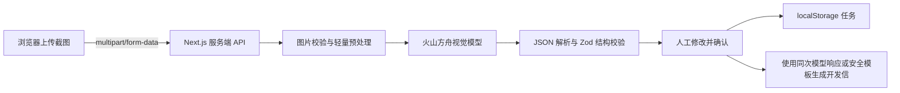

# 当前架构与升级方向

## 当前架构

应用使用 Next.js App Router、TypeScript、React 和 Tailwind CSS。客户截图识别通过 Node.js Runtime 的服务端 Route 调用火山方舟；其余需要浏览器能力的工作流组件为 Client Component。

```text
页面 / 组件
  → AppDataProvider（内存状态与页面同步）
    → storageRepository（唯一 localStorage 访问边界）
      → 浏览器 localStorage

任务工作流
  → /api/analyze-customer（真实视觉分析或配置探测）
  → mock defaults（明确标记的演示视觉分析）
  → 同一次视觉模型响应中的结构化分析与开发信
  → safe message generator（渠道适配与安全回退）
  → MessageVersion（不可覆盖的版本快照）
```

截图创建 `URL.createObjectURL` 本地预览；真实模式下原始 `File` 通过 multipart/form-data 发到 Next.js 服务端。服务端在内存中验证文件签名、大小和尺寸，用 Sharp 修正方向并按需缩放压缩，再以 data URL 调用火山方舟。保存任务时仍只记录文件名、格式和大小，不把图片 Base64 写入 localStorage。



API Key、模型 ID 和 Base URL 仅由服务端读取。客户端只会获得模式标记、经校验的分析结果、安全错误摘要和请求 ID，不会收到密钥、完整上游响应、base64 图片或服务端堆栈。服务端日志仅记录请求 ID、时间、图片数量/总大小、耗时、HTTP 状态和错误类型。

## 数据边界

`types/index.ts` 定义视觉响应、证据、Customer、CustomerAnalysis、Task、TaskImage、MessageVersion、CompanyProfile、Product、FollowUp 及配置、状态类型。任务用 `analysisSource` 区分 `volcengine`、`mock` 与旧任务 `legacy`。生成器只接收经过人工确认的客户、分析和生成配置；页面不直接读写 localStorage。

## 真实 AI 边界

1. 当前已接入视觉分析 API Route；图片不落盘、不进入对象存储。
2. 模型 JSON 必须通过运行时 Schema；允许对非关键缺失字段使用安全默认值，无法解析或关键结构错误即失败。
3. 人工确认是视觉结果进入后续开发信的唯一边界，模型原始输出不会直接用于生成。
4. 同一次火山方舟请求同时返回客户分析、独立推测、英文开发信与中文翻译；不会为文本生成追加第二次模型调用。模型邮件不满足长度或事实安全规则时，客户端使用不引用低置信度信息的安全模板。

## Supabase 升级

使用 Supabase Auth 管理账号；Postgres 建议拆分 customers、tasks、task_images、message_versions、follow_ups、company_profiles、products 表；Storage 保存原始截图。所有 Schema 变化必须通过 migration，使用 Row Level Security 隔离用户数据。localStorage 可保留为未登录草稿缓存，并提供一次性迁移。

## 生产化补充

增加运行时环境变量校验、上传大小与类型的服务端复验、速率限制、重试、审计日志、数据导出/删除、单元测试和 Playwright 端到端测试。不要实现 LinkedIn 自动登录、抓取或自动发送，除非合规方案和用户授权边界已经明确。
